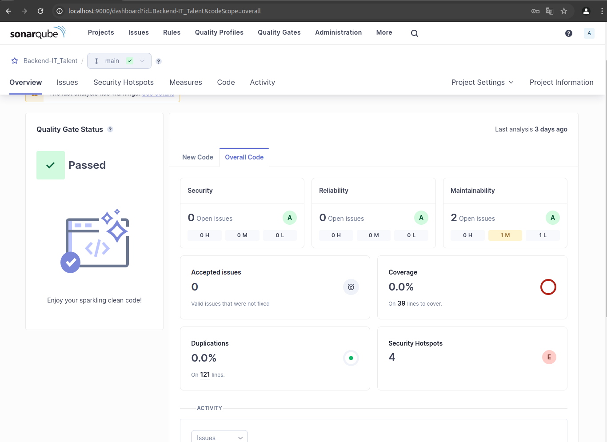
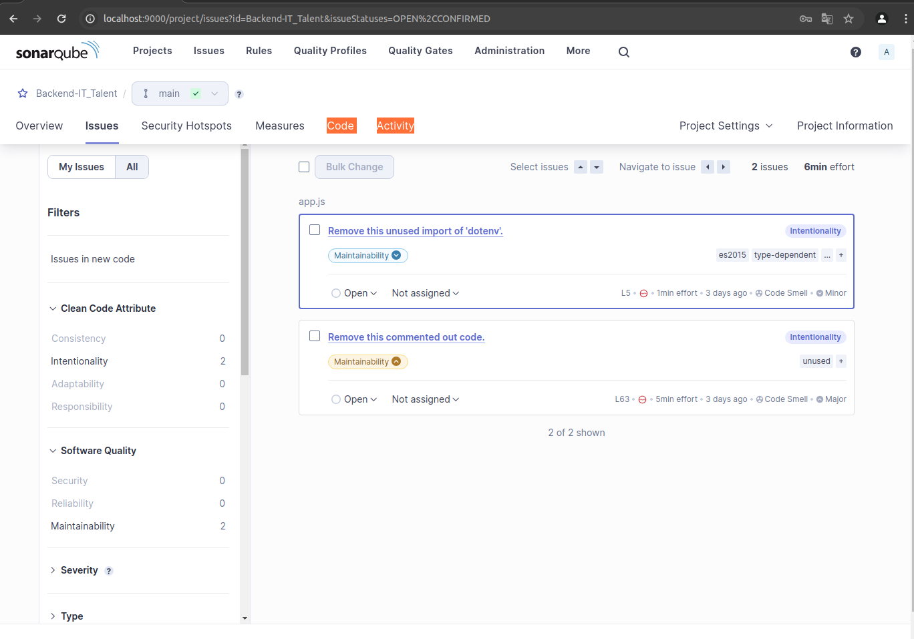
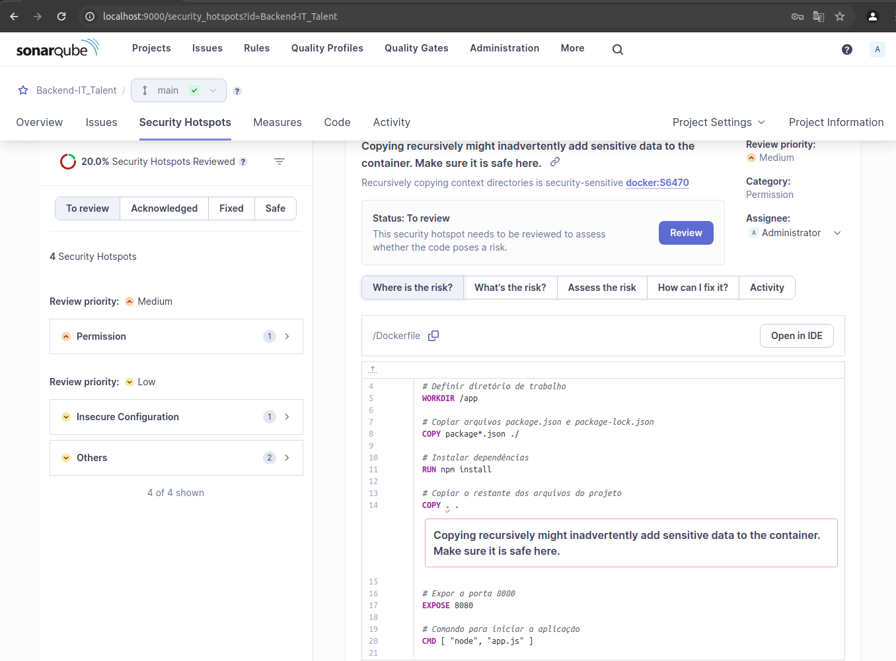
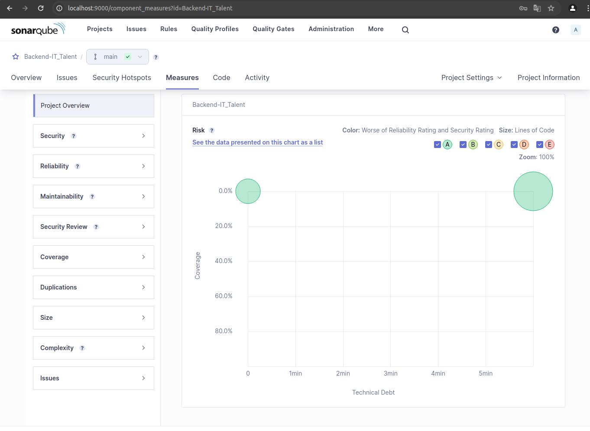
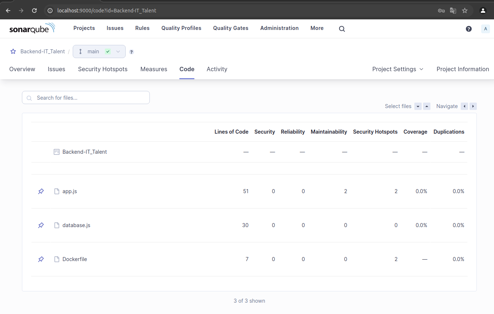
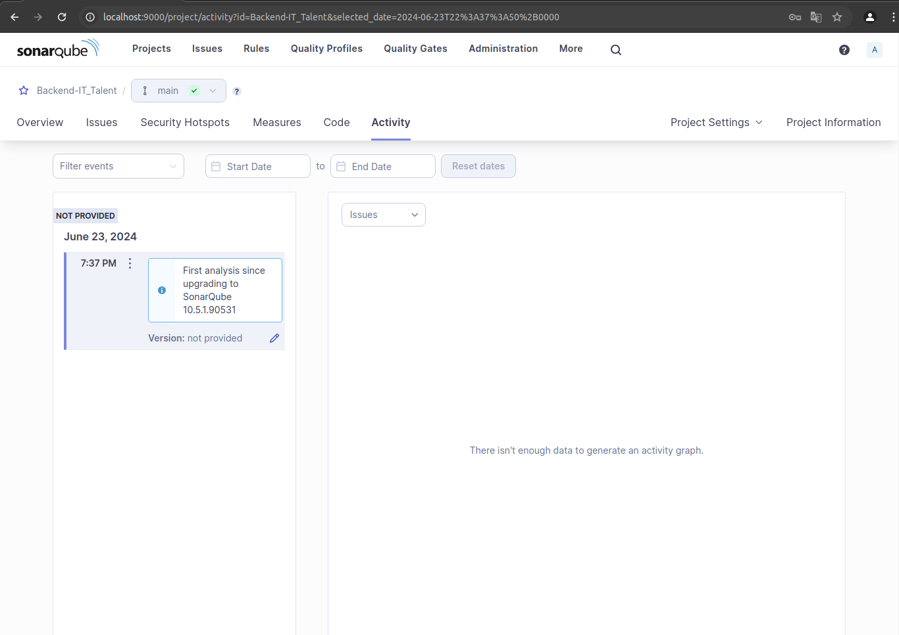
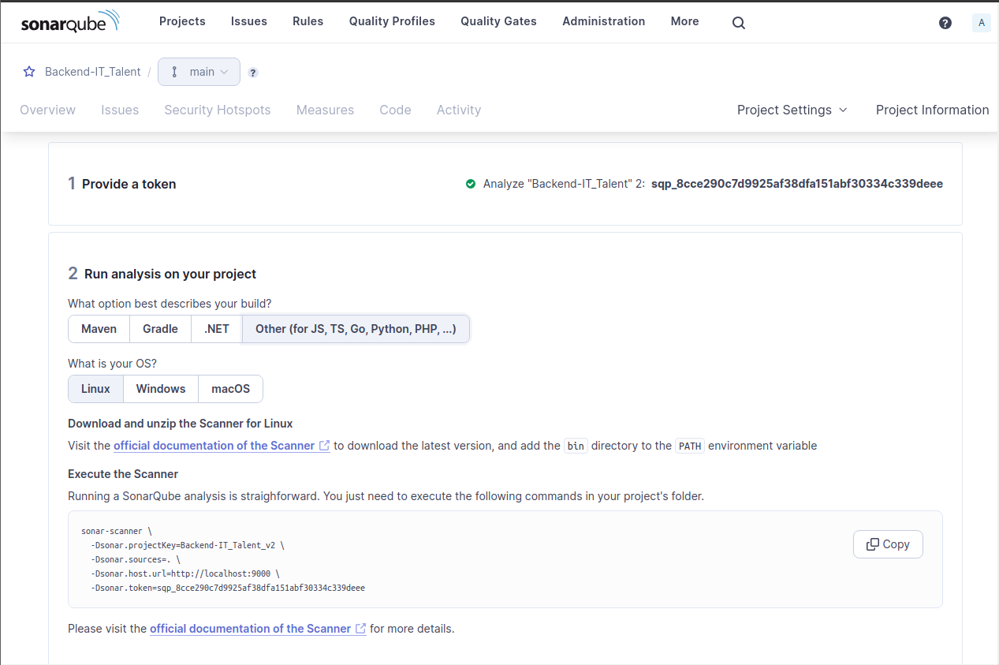
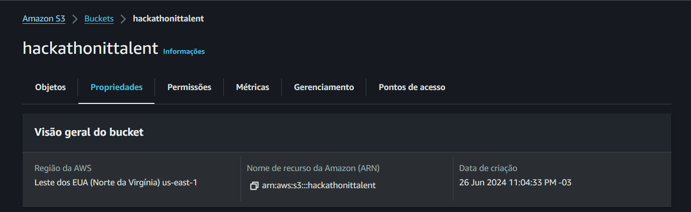
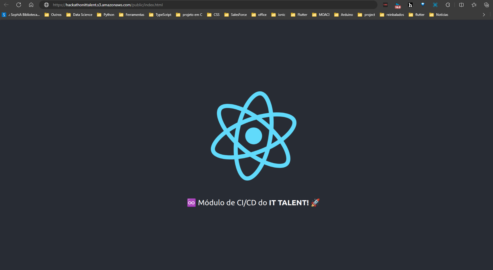

# Atividade 1 (5,0 pontos)

## Entregáveis:

### Prints dos resultados do escaneamento conforme pdf em anexo do Sonarqube

#### Overview

#### Issues

#### Security Hotspots

#### Measures

#### Code

#### Activity

### Print do token gerado

# Atividade 2 (5,0 pontos)

## Entregáveis:

### O arquivo de workflow do github actions no seu repositório github público
[Link para o arquivo de workflow](lhttps://github.com/erikbernard/ReactBasic/blob/main/.github/workflows/node.js-ci.yml)

### Prints:

#### Print do ID do recurso do seu S3 no Console AWS

#### Print de acesso ao link público com o build sendo acessado

# Getting Started with Create React App

This project was bootstrapped with [Create React App](https://github.com/facebook/create-react-app).

## Available Scripts

In the project directory, you can run:

